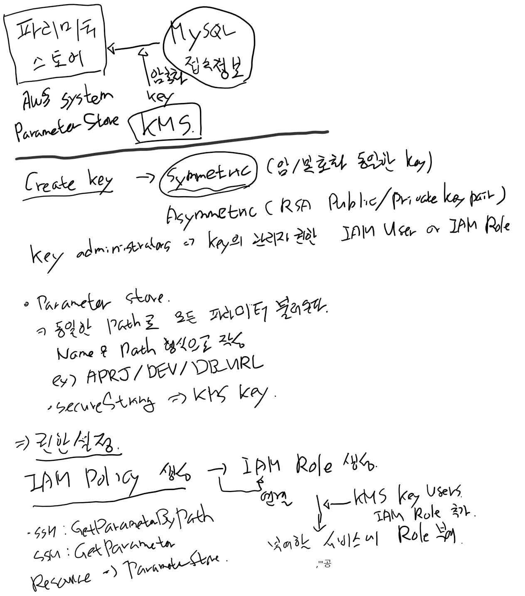

# Spring boot에서 aws kms를 이용한 프로퍼티 값 암호화 하기 
2022.03.06 14:00 write by jms   

db 정보나 apk key 등 중요 정보에 대해서 git 계정에 들어가면 문제가 발생할 수 있다. 이런 보안이 필요한 값들은 처음부터 암호화해서 등록할 수 있다. AWS KMS를 이용해서 sprint boot 프로젝트의 프로퍼티 값을 암호화 할 수 있다.   
```yaml
datasource:
  url: jdbc:mysql://localhost:33306/test?serverTimezone=UTC&characterEncoding=UTF-8
  username: xxxxx
  password: xxxxxxxx
  driver-class-name: com.mysql.cj.jdbc.Driver
```
### AWS IAM 생성
kms는 AWS IAM USER나 ROLE을 통해서 권한을 가질 수 있다.  따라서 local에서 사용할 iam이나 role을 만들어서 수행합니다.   
해당 사용자에게 AmazonSSMFullAccess, AmazonSSMReadOnlyAccess 정책을 추가해야 한다.

### KMS(Key Management Service) 생성
- Key Alias : systems-dev-key
- Key policy
  - Key administrators : xxxxx
  - Key users : Systems-ParameterStoreRule (Role)
### AWS System Manager의 StoreParameter 추가
- Name : /systems/databaseinfo_dev/jdbcurl
- Value : xxxxx (SecureString)
### Systems-ParameterStoreRule
```json
{
    "Version": "2012-10-17",
    "Statement": [
        {
            "Effect": "Allow",
            "Action": [
                "ssm:GetParametersByPath",
                "ssm:GetParameter"
            ],
            "Resource": "arn:aws:ssm:ap-northeast-2:xxxxxxxxx:parameter/*"
        },
        {
            "Effect": "Allow",
            "Action": [
                "kms:Decrypt",
                "kms:Encrypt",
                "kms:GenerateDataKey"
            ],
            "Resource": [
                "arn:aws:kms:ap-northeast-2:xxxxxxxxx:key/xxxxxxxxxxxxxxxxxxxxxxxxxxxxxxxxxxxxxxx"
            ]
        }
    ]
}
```
### bootstrap.yml
```yaml
# {prefix}/{name}{profileSeparator}{profile}/parameter.key
aws:
  paramstore:
    enabled: true
    prefix: /systems
    name: databaseinfo
    profileSeparator: _
  s3:
    enabled: true
```
### application.yml
```yaml
spring:
  profiles:
    active: dev

cloud.aws:
  region.static: ap-northeast-2
  stack.auto: true

---
srping:
  profiles: dev
  application:
    name: Kms-test-pjt

cloud:
  aws:
    credentials:
      profile-name: dev
    stack.auto: false

```
### aws configure --profile dev 수행
위에서 aws credentials의 profile-name을 dev로 정의했고 Parameter store에서도 dev로 데이터를 찾는다.   
```shell
$> aws configure --profile dev
```
### Usage
```java
package com.bithumbsystems.config;

import lombok.Getter;
import lombok.NoArgsConstructor;
import lombok.Setter;
import org.springframework.beans.factory.annotation.Value;
import org.springframework.context.annotation.Configuration;

@Getter
@Setter
@NoArgsConstructor
@Configuration
public class ParameterStoreProperties {
    @Value("${jdbcurl}")
    private String dbUrl;
}
```
### Test Code
```java
package com.bithumbsystems.config;


import org.junit.jupiter.api.Test;
import org.junit.jupiter.api.extension.ExtendWith;
import org.springframework.beans.factory.annotation.Autowired;
import org.springframework.boot.test.context.SpringBootTest;
import org.springframework.test.context.junit.jupiter.SpringExtension;

import static org.assertj.core.api.Assertions.assertThat;

@ExtendWith(SpringExtension.class)
@SpringBootTest
public class ParameterStorePropertiesTest {
    @Autowired
    private ParameterStoreProperties properties;

    static {
        System.setProperty("com.amazonaws.sdk.disableEc2Metadata", "true");
    }
    @Test
    void local_parameter_test() throws Exception {
        assertThat(properties.getDbUrl()).isEqualTo("test");
    }
}

```
## Window AWS CLI2 설치 
윈도우 command 창에서 아래와 같이 수행   
```shell
msiexec.exe /i https://awscli.amazonaws.com/AWSCLIV2.msi
```
## Throubleshooting
```shell
com.amazonaws.AmazonClientException: EC2 Instance Metadata Service is disabled
```
EC2를 사용하지 않는데도 위와 같이 에러가 발생한다. 아래 정보를 VM Arguments에 추가한다.   
Modify Run Configuration을 통해서 수정할 수 잇다.    
-Dcom.amazonaws.sdk.disableEc2Metadata=true   
실행하면 com.amazonaws.AmazonClientException: EC2 Instance Metadata Service is disabled 에러가 나올 것이다. 이것은 우리가 의도한 것이다.


# Spring boot + Redis (in docker)
## docker에 redis 설치 하기 
```shell
minsoub@DESKTOP-QBEPT26:/mnt/c/DevPjt$ docker pull redis:alpine
alpine: Pulling from library/redis
59bf1c3509f3: Pull complete
719adce26c52: Pull complete
b8f35e378c31: Pull complete
d034517f789c: Pull complete
3772d4d76753: Pull complete
211a7f52febb: Pull complete
Digest: sha256:4bed291aa5efb9f0d77b76ff7d4ab71eee410962965d052552db1fb80576431d
Status: Downloaded newer image for redis:alpine
docker.io/library/redis:alpine
minsoub@DESKTOP-QBEPT26:/mnt/c/DevPjt$ docker images
REPOSITORY   TAG       IMAGE ID       CREATED        SIZE
redis        alpine    3900abf41552   3 months ago   32.4MB
```
redis-cli 구동 연결을 위해서 2개의 컨테이너를 실행해야 하고 2개간의 네트워크가 연결이 되엉야 한다.  따라서 docker network를 구성하고 연결한다.
```shell
minsoub@DESKTOP-QBEPT26:/mnt/c/DevPjt$ docker network create redis-net
28e86f3ded28345b3f063bc18ce20bdb1230147cde24c9fe5a7ee327b7767e43
minsoub@DESKTOP-QBEPT26:/mnt/c/DevPjt$ docker network ls
NETWORK ID     NAME        DRIVER    SCOPE
d48a1c691916   bridge      bridge    local
160dce1260d1   host        host      local
5bda736f39b7   none        null      local
28e86f3ded28   redis-net   bridge    local
```
redis를 redis-net 네트워크를 사용해서 컨테이너를 가동시킨다.
```shell
minsoub@DESKTOP-QBEPT26:/mnt/c/DevPjt$  docker run --name redisDB -p 6379:6379 --network redis-net -v /mnt/c/DevPjt/docker-volume/redis -d redis:alpine redis-server --app
endonly yes
e6d6b2bfeef4fdb801ed8c4f7f0339f3724672b4f25010328eefada971ff0485
```
redis container 확인
```sehll
minsoub@DESKTOP-QBEPT26:/mnt/c/DevPjt$ docker container ps -al
CONTAINER ID   IMAGE          COMMAND                  CREATED          STATUS          PORTS                    NAMES
e6d6b2bfeef4   redis:alpine   "docker-entrypoint.s…"   43 seconds ago   Up 41 seconds   0.0.0.0:6379->6379/tcp   redisDB
```
redis-cli로 redis server 접속
```shell
minsoub@DESKTOP-QBEPT26:/mnt/c/DevPjt$ docker run -it --network redis-net redis:alpine redis-cli -h redisDB
```
P3X redis UI를 사용해서 redis에 접속할 수 있다.    
https://www.electronjs.org/apps/p3x-redis-ui    

## spring boot와 연동
- gradle.build
```groovy
    // redis
    implementation 'org.springframework.boot:spring-boot-starter-data-redis'
```
- application.yml
```yaml
spring:
  redis:
    port: 6379
    host: 127.0.0.1
```
- RedisConfig class
```java
package com.bithumbsystems.config;

import org.springframework.beans.factory.annotation.Value;
import org.springframework.context.annotation.Bean;
import org.springframework.context.annotation.Configuration;
import org.springframework.data.redis.connection.RedisConnectionFactory;
import org.springframework.data.redis.connection.RedisStandaloneConfiguration;
import org.springframework.data.redis.connection.lettuce.LettuceConnectionFactory;
import org.springframework.data.redis.core.RedisTemplate;
import org.springframework.data.redis.serializer.StringRedisSerializer;

@Configuration
public class RedisConfig {

    @Value("${spring.redis.host}")
    private String redisHost;

    @Value("${spring.redis.port}")
    private String redisPort;

    @Bean
    public RedisConnectionFactory redisConnectionFactory() {
        RedisStandaloneConfiguration redisStandaloneConfiguration = new RedisStandaloneConfiguration();
        redisStandaloneConfiguration.setHostName(redisHost);
        redisStandaloneConfiguration.setPort(Integer.parseInt(redisPort));

        LettuceConnectionFactory lettuceConnectionFactory = new LettuceConnectionFactory(redisStandaloneConfiguration);
        return lettuceConnectionFactory;
    }

    @Bean
    public RedisTemplate<String, Object> redisTemplate() {
        RedisTemplate<String, Object> redisTemplate = new RedisTemplate<>();
        redisTemplate.setConnectionFactory(redisConnectionFactory());
        redisTemplate.setKeySerializer(new StringRedisSerializer());
        redisTemplate.setValueSerializer(new StringRedisSerializer());
        return redisTemplate;
    }
}
```
- User Repository class
```java
package com.bithumbsystems.repository;

import com.bithumbsystems.domain.User;
import org.springframework.data.repository.CrudRepository;

public interface UserRepository extends CrudRepository<User, String> {
}
```
- Test code
```java
package com.bithumbsystems.repository;


import com.bithumbsystems.domain.User;
import org.junit.jupiter.api.Test;
import org.junit.jupiter.api.extension.ExtendWith;
import org.springframework.beans.factory.annotation.Autowired;
import org.springframework.boot.test.context.SpringBootTest;
import org.springframework.data.redis.core.RedisTemplate;
import org.springframework.test.context.junit.jupiter.SpringExtension;

import java.util.List;

import static org.assertj.core.api.Assertions.assertThat;

@ExtendWith(SpringExtension.class)
@SpringBootTest
public class UserRepositoryTest {
    @Autowired
    private RedisTemplate<String, String> redisTemplate;

    @Autowired
    private UserRepository repository;

    @Test
    void redis_user_insert_test() throws Exception {
        User user = new User();
        user.setEmail("minsoub@gmail.com");
        user.setUsername("Joung minsoub");
        repository.save(user);

        List<User> list = (List<User>) repository.findAll();

        assertThat(list.size()).isNotEqualTo(0);
        assertThat(list.get(0).getEmail()).isEqualTo("minsoub@gmail.com");
    }
};
```